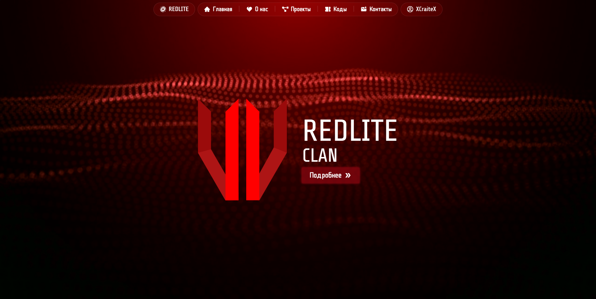

# RedLite Clan - Платформа команды


## Stack
- **Langs** - Python, TypeScript, Html, Css

- **Data** - PostgreSQL, asyncpg, sqlalchemy, zustand

- **Frontend** - Next, React, Tailwind, shadcn

- **API** - FastAPI, axios, pydantic, react-query


## Installation
#### 1. Clone the repository
```bash
git clone https://github.com/xcraitex/new-redlite-ru.git
```

#### 2. Edit config.ts
```ts
export const API_URL = 'your_domain.com/api/'
```

#### 3. Install dependencies 
```bash
cd backend
pip install -r requirements.txt
```
```bash
cd frontend
npm i 
```

#### 4. Building project
```bash
cd frontend
npm run build
```

### 5. Run builds
```bash
cd frontend
npm start
```
```bash
cd backend
python app/main.py
```